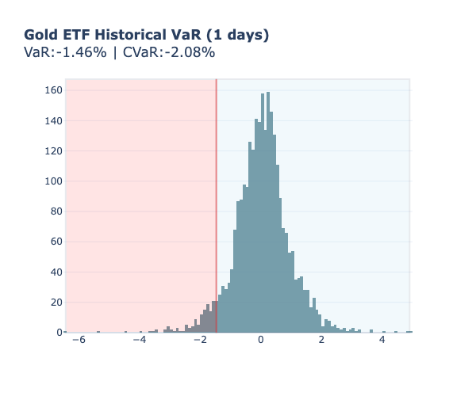
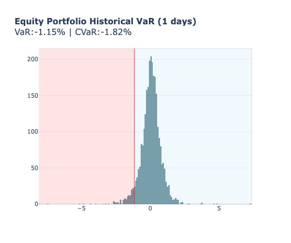

# Var-risk-analysis

This project looks at downside risk for a few major stocks and commodities using historical market data, focusing mainly on Value-at-Risk (VaR) and Conditional VaR (CVaR). VaR shows what you can lose given a certain confidence level over a period of time and CVaR shows, if you’re below that confidence cutoff, how bad it can get. Along with looking at each asset individually (SPY, Gold and IEFA) the project also builds an equal-weighted portfolio so we can compare single-asset risk to a diversified mix. The goal is to see how tail-risk changes when you combine assets vs holding them alone.

# Methods  
Prices are pulled from yfinance, then daily returns are used to estimate annual return, volatility, VaR and CVaR.  
A quick return distribution plot highlights the VaR cutoff and the CVaR region so you can visually see how often bad days occur and how ugly they get once you cross that threshold.

---

## Securities Looked At
- SPY (U.S. equities)
- A Gold ETF
- IEFA (international developed)

### Example  
Daily return distribution with VaR + CVaR highlighted:

---

## Portfolio

An equal-weighted portfolio is created using the three assets.  
Portfolio-level return, VaR and CVaR are computed to show how combining assets affects the downside.

Portfolio price progression:  

Portfolio VaR / CVaR distribution:  

---

## Conclusion

Individually SPY, IEFA and Gold all have 1-day VaRs in the ~1.4–1.7% range and CVaRs around 2–3%.  
But once they’re held together equally, portfolio VaR drops to ~1.15% and CVaR drops to ~1.8%.  
This means the combined portfolio has a less extreme downside than holding any one position alone.  
This happens because the assets don’t move perfectly together therefore diversification reduces tail-losses.

## Monte Carlo (not added yet)

Monte Carlo simulation is coming next. The idea is to simulate many random return paths based on historical vol + correlation, then estimate VaR/CVaR from that distribution and compare it to the historical approach.

