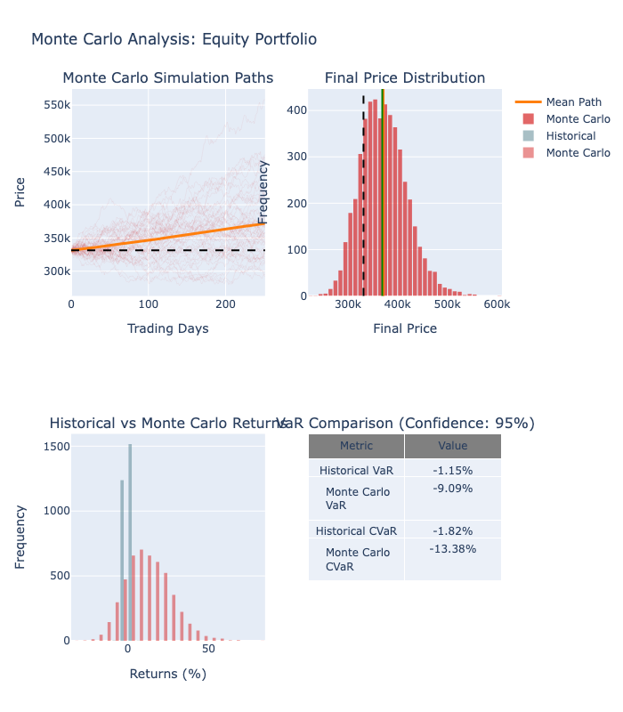

# Var-risk-analysis

This project calculates and compares two key downside risk metrics - Value-at-Risk (VaR) and Conditional Value-at-Risk (CVaR) - using both historical data and Monte Carlo simulation.
VaR estimates the maximum expected loss at a given confidence level (95% in our case). For example, a 1-day VaR of -1.5% means that on 95% of trading days, losses won't exceed 1.5%.
CVaR (Expected Shortfall) measures the average loss when the VaR threshold is breached, capturing tail risk severity beyond VaR alone, in other words it would capture how bad things can get when losses exceed 1.5%. 

# Methods  
Methods
Historical Approach:

Daily returns calculated from yfinance price data (2015-present). VaR = 5th percentile of the return distribution. CVaR = average of returns below the VaR threshold. Applied to individual securities and portfolio.
Monte Carlo Simulation:

5,000 simulations using Geometric Brownian Motion. Parameters (drift μ, volatility σ) estimated from historical data. Simulates 504 trading days (~2 years) forward. 1-day VaR calculated from simulated day-1 returns for comparison with historical VaR. Full price paths visualized to show long-term uncertainty.

## Securities Looked At
- SPY (U.S. equities)
- A Gold ETF
- IEFA (international developed)

### Example  
Daily return distribution with VaR + CVaR highlighted:

---
[Histogram of daily returns with VaR line and CVaR region highlighted in red]
What this shows: The histogram displays the distribution of daily returns. The red vertical line marks the VaR threshold—95% of returns fall to the right of this line. The dark red shaded region shows the CVaR zone, representing the worst 5% of days.

## Portfolio

An equal-weighted portfolio (33.3% each security) demonstrates diversification benefits.

Portfolio price progression:  

Portfolio VaR / CVaR distribution:  

---

## Portfolio Conclusion

Individually SPY, IEFA and Gold all have 1-day VaRs in the ~1.4–1.7% range and CVaRs around 2–3%.  
But once they’re held together equally, portfolio VaR drops to ~1.15% and CVaR drops to ~1.8%. 
Meaning that divesification leads to a VaR 20% to 30% lower than any individual assert.
This means the combined portfolio has a less extreme downside than holding any one position alone.  
This happens because the assets don’t move perfectly together therefore diversification reduces tail-losses.

## Monte Carlo (Partially Completed, Working)

Implemented a functioning Monte Carlo simulation to generate future returns using historical volatility and correlated assumptions.  
The current implementation focuses on basic simulations and distributions in a dashboard-type style. Future updates will align the 
visualizations stylistically and analytically to compare real-world historical data to simulated Monte Carlo data, in both individual and portfolio settings.

.png)

