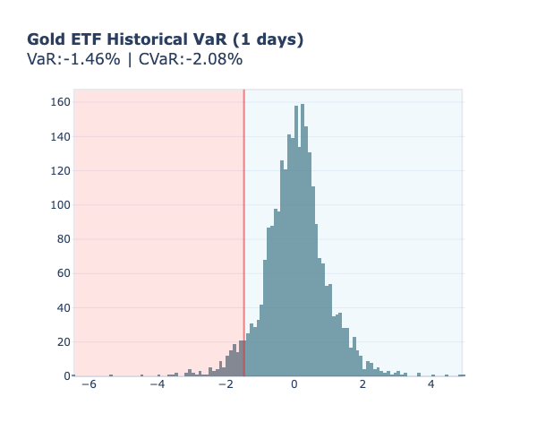
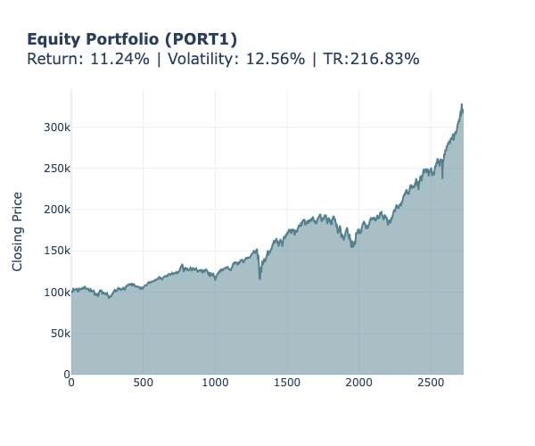
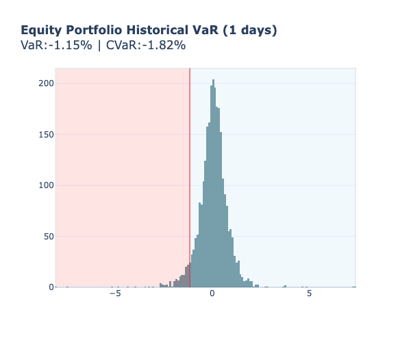
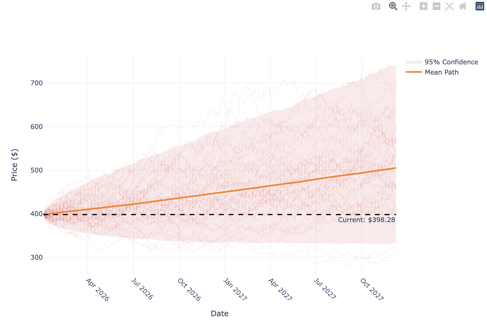
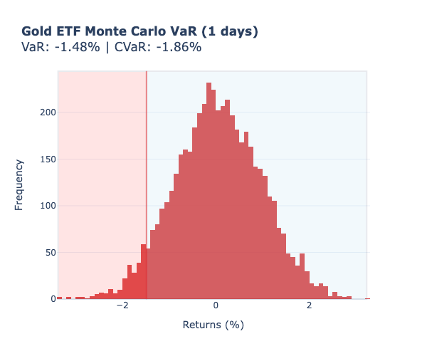
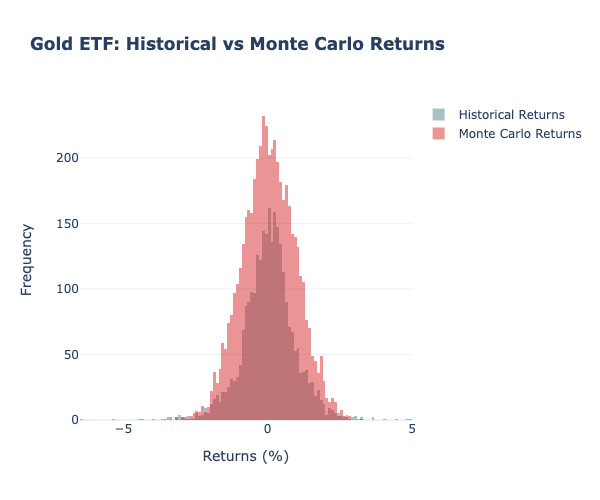
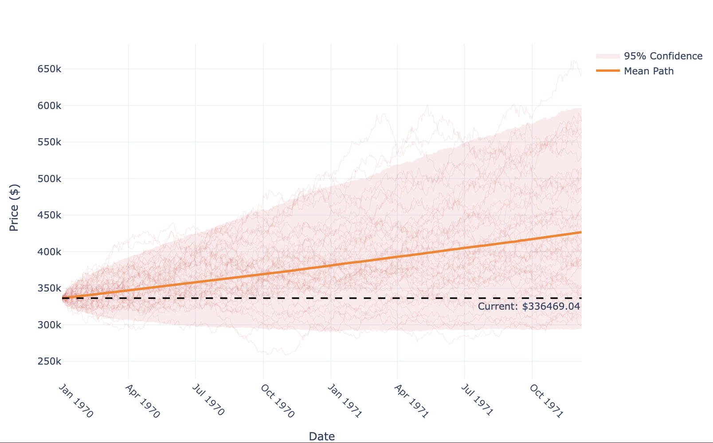

# Var-risk-analysis

This project calculates and compares two key downside risk metrics - Value-at-Risk (VaR) and Conditional Value-at-Risk (CVaR) - using both historical data and Monte Carlo simulation.
VaR estimates the maximum expected loss at a given confidence level (95% in our case). For example, a 1-day VaR of -1.5% means that on 95% of trading days, losses won't exceed 1.5%.
CVaR (Expected Shortfall) measures the average loss when the VaR threshold is breached, capturing tail risk severity beyond VaR alone, in other words it would capture how bad things can get when losses exceed 1.5%. 

# Methods  
Historical Approach:

Daily returns calculated from yfinance price data (2015-present). VaR = 5th percentile of the return distribution. CVaR = average of returns below the VaR threshold. Applied to individual securities and portfolio.
Monte Carlo Simulation:

5,000 simulations using Geometric Brownian Motion. Parameters (mean return μ, volatility σ) estimated from historical data. Simulates 504 trading days (~2 years) forward. 1-day VaR calculated from simulated day-1 returns for comparison with historical VaR. Full price paths visualized to show long-term uncertainty.

## Securities Looked At
- SPY (U.S. equities)
- A Gold ETF
- IEFA (international developed)

### Example  
[Histogram of daily returns with VaR line and CVaR region highlighted in red]:

---

What this shows: The histogram displays the distribution of daily returns. The red vertical line marks the VaR threshold—95% of returns fall to the right of this line. The dark red shaded region shows the CVaR zone, representing the worst 5% of days.

## Portfolio

An equal-weighted portfolio (33.3% each security) demonstrates diversification benefits.

Portfolio price progression:  

Portfolio VaR / CVaR distribution:  

---

## Portfolio Conclusion

Individually SPY, IEFA and Gold all have 1-day VaRs in the ~1.4–1.7% range and CVaRs around 2–3%.  
But once they’re held together equally, portfolio VaR drops to ~1.17% and CVaR drops to ~1.84%. 
Meaning that divesification leads to a VaR 20% to 30% lower than any individual assets.
This means the combined portfolio has a less extreme downside than holding any one position alone.  
This happens because the assets don’t move perfectly together therefore diversification reduces tail-losses.

## Monte Carlo Simulation Results 

## Individual Securities:
For each security, we ran 5,000 simulations to generate potential future scenarios.

## Example GLD

[Monte Carlo price paths showing 50 individual paths, mean path in orange, 95% confidence band]

___

What this shows: 
Light red lines are individual simulated paths; orange line is the mean expected path; pink band captures 95% of outcomes. Starting price marked by black dashed line. The widening band over time illustrates increasing forecast uncertainty.

[Monte Carlo return histogram with VaR/CVaR marked]:

What this shows:
Distribution of simulated 1-day returns. The shape closely resembles the historical distribution, validating our modeling assumptions.

[Side-by-side histogram comparison: Historical vs Monte Carlo returns]

___
What this shows: 
Overlaid histograms demonstrate agreement between historical and simulated return distributions. Close VaR alignment indicates consistent risk assessment across both methods.
With simulation slightly overestimating VaR leading to a fatter looking distribution to its historical counterpart.

## Monte Carlo Portfolio Analysis

[Portfolio Monte Carlo price paths]

___
What this shows: 
Even in simulations, the portfolio exhibits lower volatility than individual assets, as seen by the tighter confidence band relative to single asset simulations.

Note: If Path Visualization doesnt show click autoscale button.

[Portfolio Monte Carlo distribution]

.png)

___

What this shows: 
The simulated portfolio maintains its diversification benefit, with VaR remaining lower than individual securities even in simulated scenarios.

## Summary Comparison Table

| Security/Portfolio | Historical VaR | Monte Carlo VaR | Historical CVaR | Monte Carlo CVaR |
|-------------------|----------------|-----------------|-----------------|------------------|
| SPY | -1.67% | -1.78% | -2.72% | -2.23% |
| GLD | -1.47% | -1.48% | -2.09% | -1.86% |
| IEFA | -1.55% | -1.77% | -2.53% | -2.22% |
| **Portfolio** | **-1.17%** | **-1.24%** | **-1.84%** | **-1.57%** |

## Key Takeaways:

- (1) Method Validation: Historical and Monte Carlo VaR values show strong agreement (average difference ~0.1%), confirming model consistency and validating the Geometric Brownian Motion assumptions. 
- (2) Diversification Works: The equal-weighted portfolio reduces VaR by 20-30% compared to individual securities across both methodologies, demonstrating quantifiable risk reduction through imperfect correlation. 
- (3) CVaR Reveals Tail Severity: Tail losses (CVaR) average 25-60% worse than VaR thresholds, with individual assets showing CVaR values ranging from -1.86% to -2.72% while the portfolio maintains lower tail risk at -1.57% to -1.84%.
- (4) Monte Carlo simulation validates diversification benefits persist in forward-looking scenarios, with the portfolio maintaining its risk advantage over a 504-day projection period.

